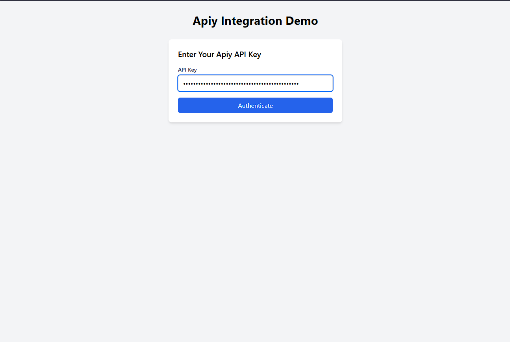
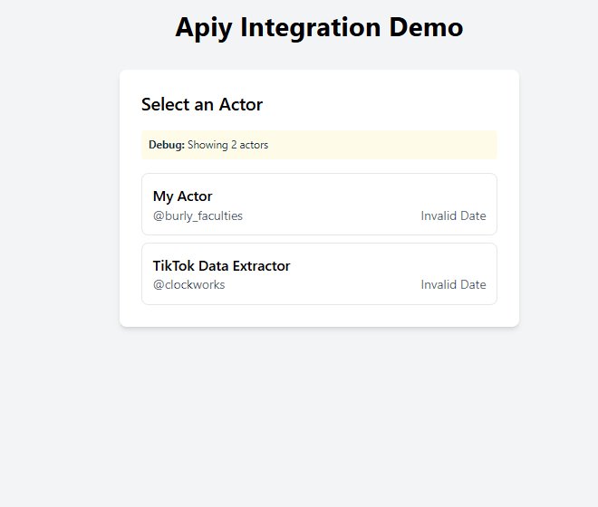
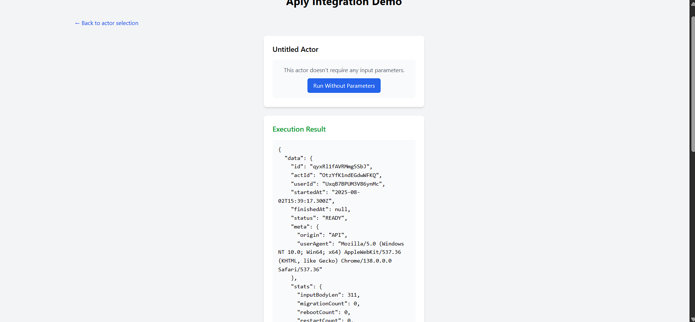

Apify Integration Demo

Overview
This project is a React frontend application integrated with the Apify API. It allows users to select Apify actors, view their input schemas, and execute them with custom inputs. The app uses Vite as the build tool and development server.

---

Installation and Running the Application

Prerequisites
- Node.js (v16 or later recommended)
- npm (comes with Node.js)

Steps

1. Clone the repository or download the source code.

2. Navigate to the `client` directory:
   ```bash
   cd client
   ```

3. Install dependencies:
   ```bash
   npm install
   ```

4. Start the development server:
   ```bash
   npm run dev
   ```

5. Open your browser and go to:
   ```
   http://localhost:5173
   ```

---

API Proxy Configuration

The app uses Vite's development server proxy to forward API requests from `/api` to the Apify API (`https://api.apify.com/v2`). This avoids CORS issues during development.

---

Actor Used for Testing

For testing, the following actors were used:
- `clockworks/free-tiktok-scraper`
- `burly_faculties/my-actor`

These actors demonstrate fetching actor lists, schemas, and executing actors.

---

Assumptions and Design Choices

- The app assumes the Apify API endpoints follow the `/v2/acts/{actorId}` pattern.
- Actor IDs are URL-encoded to handle slashes in usernames and actor names.
- The input schema endpoint (`/input-schema`) may not be available for all actors; the app handles 404 errors gracefully.
- Vite proxy is configured to rewrite `/api` to `/v2` on the Apify API.
- Axios baseURL is set to `/api` to enable proxying.
- The app uses React functional components with hooks for state and effects.
- Tailwind CSS is used for styling.

---

Screenshots and Working Flow

Actor Selection
- Displays a list of actors fetched from the Apify API.
- User selects an actor to view its input schema.

Actor Input Form
- Shows input fields based on the actor's input schema.
- Handles missing schema gracefully by showing a message.

Actor Execution
- User submits input parameters to execute the actor.
- Displays execution results or errors.

Example Screenshot



---

Notes

- Ensure you have a valid Apify API key to use the app.
- The app currently supports development mode with Vite proxy; production deployment may require additional backend proxy setup.
- For actors without input schemas, the app allows execution without parameters.

---

If you have any questions or need further assistance, feel free to reach out.
